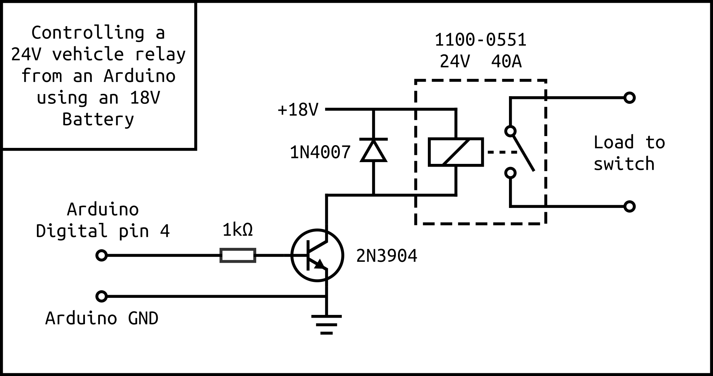

# arsy
Using an Arduino Nano to decode the servo signal from the 3rd channel (A and B switch) of an RC receiver to control a 24V 40A relay.

Created for a Spektrum SLT3 3-Channel SLT Transmitter with SLR300 Receiver.

Servo library: https://github.com/dmadison/ServoInput/

## Nano connections
Connect servo signal to nano digital pin 2

Connect servo ground to nano ground

Connect servo VCC to nano VIN

Connect the relay control circuit to digital pin 4

## Circuit diagram for controlling the relay

